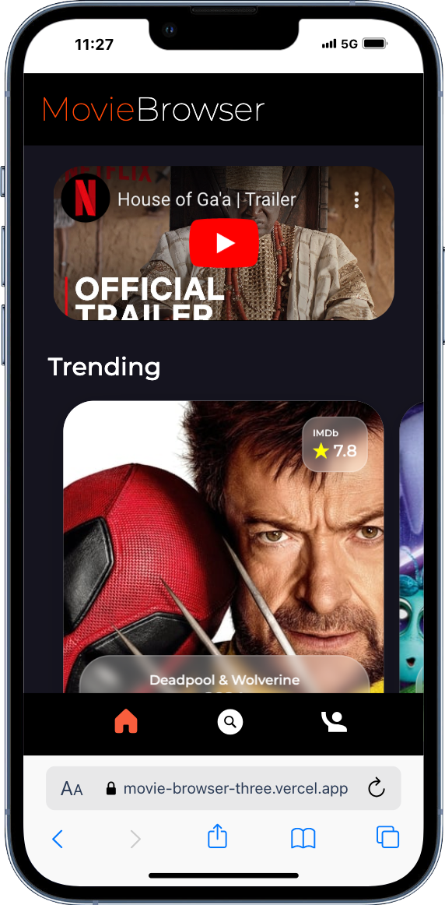
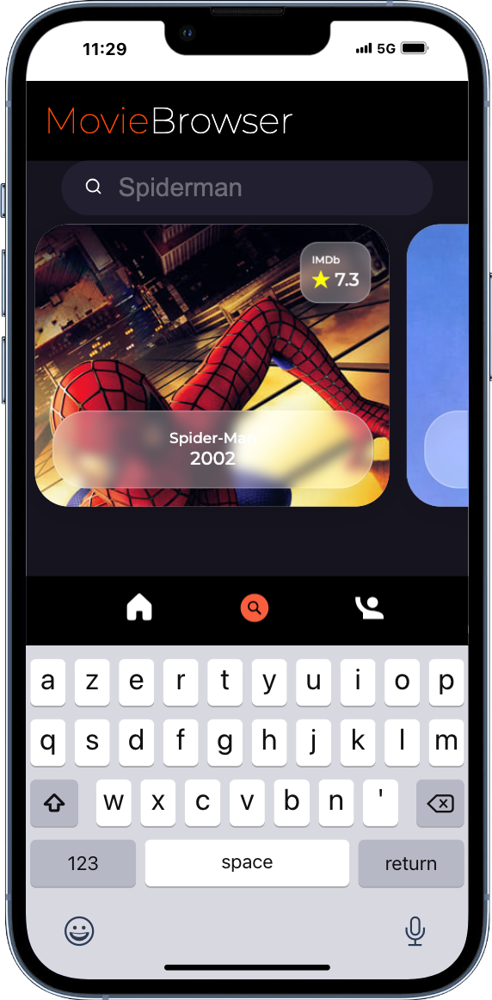
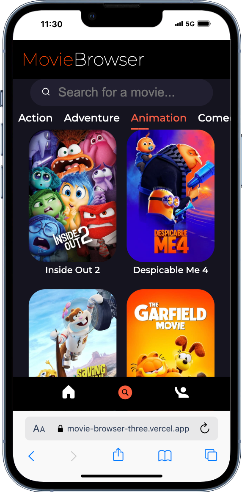
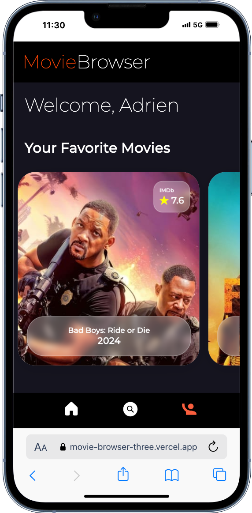

# Projet Movie Browser

### Formation Becode
Projet de développement d'une application web utilisant React et React Router, construit avec Vite.

## Application Web Movie Browser
Création d'une application permettant de consulter des informations sur les films via l'API de [The Movie Database (TMDb)](https://www.themoviedb.org/).

## Description fonctionnalité

- **Page d'accueil :** Affichage des films tendances avec leurs notes, et une vidéo liée à l'un des films.
- **Détail des films :** Liens vers les descriptions détaillées des films incluant la durée, le synopsis, la date de sortie, etc.
- **Recherche :** Page dédiée à la recherche de films via une barre de recherche ou par genre.
- **Connexion :** Page de connexion au compte [TMDb](https://www.themoviedb.org/) avec affichage des favoris.
- **Gestion des favoris :** Si connecté, possibilité d'ajouter ou de retirer des films de vos favoris.

## Lien

[Movie Browser](https://movie-browser-three.vercel.app/)

## Image

### Remerciements
Merci à l'équipe de BeCode pour le soutien et les ressources pendant ce projet.
